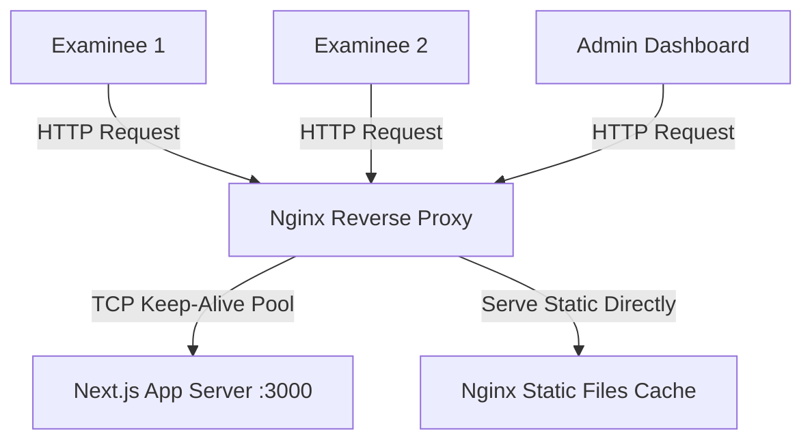

# Nginx Reverse Proxy & Load Balancer Setup

This directory contains the production-grade Nginx configuration engineered to handle **200 to 500+ concurrent examinees** writing exams simultaneously on the Redlix Secure platform.

## Architecture Overview

Nginx acts as the front-facing entry point (on port `80` or `443`), handling incoming client connections and proxying them to the Next.js local server (on port `3000` via TCP loopback).



### Why Nginx is Required for Concurrency (200-500 Users):
1. **Connection Pooling (`keepalive`)**: Next.js/Node.js otherwise spins up separate TCP connections for every single candidate request, quickly exhausting socket file descriptors. Nginx keeps a pool of open persistent connections (`keepalive 128`) to the upstream, optimizing response time and system CPU.
2. **Static Asset Offloading**: Requests for static stylesheets, scripts, fonts, and icons bypass Next.js server threads entirely and are served directly by Nginx from memory/disk cache, saving core CPU threads.
3. **Optimized Payloads**: The base64 webcam snapshot frames (which upload every 2.5s per examinee) are buffered gracefully in memory (`client_body_buffer_size 512k`) without causing database socket locks or slow request timeouts on Next.js.
4. **DDoS & Flood Protection**: IP connection limiting (`limit_conn`) and request rate limiting (`limit_req`) protect sensitive endpoints like authentication, login, and registration.

---

## Deployment & Setup Instructions

### 1. Installation

#### For macOS (Local Development / Testing)
Install Nginx using Homebrew:
```bash
brew install nginx
```

#### For Linux (Ubuntu/Debian Production)
Install Nginx using `apt`:
```bash
sudo apt update
sudo apt install nginx -y
```

### 2. Configure Nginx

Copy the custom configuration file into your system's Nginx folder:

#### On macOS
```bash
# Backup default config
mv $(brew --prefix)/etc/nginx/nginx.conf $(brew --prefix)/etc/nginx/nginx.conf.backup

# Symlink or copy the custom configuration file
cp /Users/rishirohankalapala/proctroing/web/nginx/nginx.conf $(brew --prefix)/etc/nginx/nginx.conf
```

#### On Linux
```bash
# Backup default config
sudo mv /etc/nginx/nginx.conf /etc/nginx/nginx.conf.backup

# Copy the custom configuration file
sudo cp /Users/rishirohankalapala/proctroing/web/nginx/nginx.conf /etc/nginx/nginx.conf
```

### 3. Verify and Run

Check if the configuration file contains any syntax issues:
```bash
# macOS
nginx -t

# Linux
sudo nginx -t
```
*Expected Output:*
> nginx: the configuration file ... syntax is ok  
> nginx: configuration file ... test is successful

Start the Nginx daemon service:

#### On macOS
```bash
# Start Nginx
brew services start nginx

# Or run directly in foreground for debugging
nginx
```

#### On Linux
```bash
# Start and enable on boot
sudo systemctl start nginx
sudo systemctl enable nginx
```

Now open [http://localhost](http://localhost) (Port 80) in your web browser. Nginx will route all incoming traffic directly to your Next.js application server.

---

## Log Monitoring & Auditing

To view live connections, request delays, and rate-limiting triggers, tail the access and error logs:

* **Access Logs**: `tail -f /var/log/nginx/access.log` (Includes connection times `rt`, connection pooling `uct`, and header delays `uht`)
* **Error Logs**: `tail -f /var/log/nginx/error.log` (Shows system warnings and client rate-limiting blocks)
